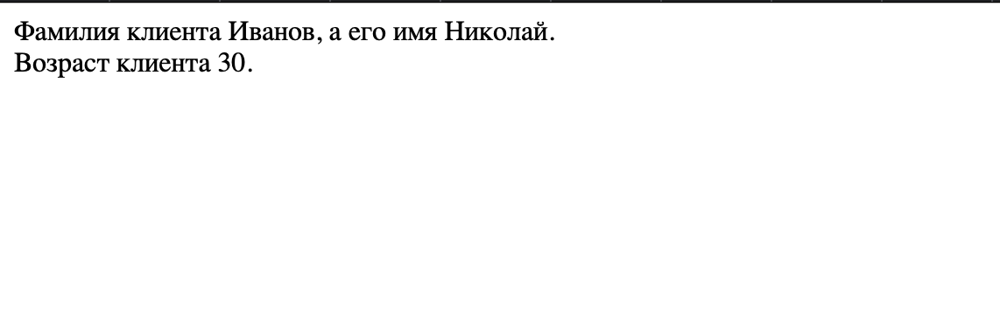
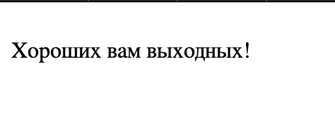

#Задание 1.

Этот PHP-скрипт выполняет следующие действия:
Создаются две переменные $nume и $prenume, содержащие значения 'Иванов' и 'Николай' соответственно.
С помощью оператора echo выводится строка, содержащая текст и значения переменных $nume и $prenume.
Создается переменная $varsta со значением 30.
С использованием оператора print выводится еще одна строка, содержащая текст и значение переменной $varsta.

Скрипт правильно выполняет работу и выводит нужную информацию.

#Задание 2.

Этот PHP-скрипт проверяет текущий день недели и выводит соответствующее сообщение в зависимости от результата.

Заменил if else на тернарный операторы и получилось:
$d=date("D");
if ($d=="Fri")
$message;
$message = ($d == "Fri") ? " Хороших вам выходных!" : " Приятного рабочего дня, вам!";
echo $message;

Скрипт выводит ту же информацию, только другим способом.

Добавил дополнительное условие:
$d=date("D");
if ($d=="Fri")
echo " Хороших вам выходных!";
elseif ($d=="Sun")
echo " Завтра начинается новая рабочая 
неделя!";
else
echo " Приятного рабочего дня, вам!";

Сегодня Tue, поэтому результат вывода не поменялся, но если был бы день недели Sun, то вывод был бы:
Завтра начинается новая рабочая

Выполнил замену буквенного параметра дня недели на цифры, изменив параметр D на w:

$d=date("w");
if ($d=="4")
echo " Хороших вам выходных!";
elseif ($d=="6")
echo " Завтра начинается новая рабочая 
неделя!";
else
echo " Приятного рабочего дня, вам!";

Изменил условие, чтобы оно выполнялось сегодня, w=2:

$d=date("w");
if ($d=="4")
echo " Хороших вам выходных!";
elseif ($d=="2")
echo " Сегодня универ!";
else
echo " Приятного рабочего дня, вам!";

Результат работы скрипта:

