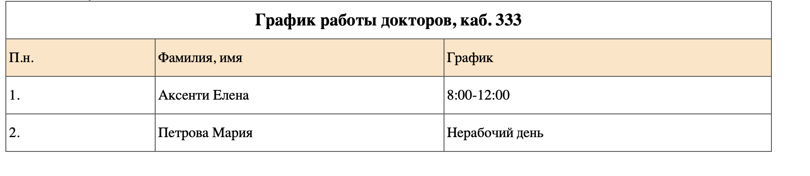

#Задание 1.

Этот PHP-скрипт выполняет следующие действия:
Создаются две переменные $nume и $prenume, содержащие значения 'Иванов' и 'Николай' соответственно.
С помощью оператора echo выводится строка, содержащая текст и значения переменных $nume и $prenume.
Создается переменная $varsta со значением 30.
С использованием оператора print выводится еще одна строка, содержащая текст и значение переменной $varsta.


Скрипт правильно выполняет работу и выводит нужную информацию.

#Задание 2.


Этот PHP-скрипт проверяет текущий день недели и выводит соответствующее сообщение в зависимости от результата.


Заменил if else на тернарный операторы и получилось:
```php
$d=date("D");
if ($d=="Fri")
$message;
$message = ($d == "Fri") ? "<br />Хороших вам выходных!" : "<br />Приятного рабочего дня, вам!";
echo $message;
```
Скрипт выводит ту же информацию, только другим способом.

Добавил дополнительное условие:
```php
$d=date("D");
if ($d=="Fri")
echo "<br />Хороших вам выходных!";
elseif ($d=="Sun")
echo "<br />Завтра начинается новая рабочая 
неделя!";
else
echo "<br />Приятного рабочего дня, вам!";
```
Сегодня Tue, поэтому результат вывода не поменялся, но если был бы день недели Sun, то вывод был бы:
Завтра начинается новая рабочая


Выполнил замену буквенного параметра дня недели на цифры, изменив параметр D на w:
```php
$d=date("w");
if ($d=="4")
echo "<br />Хороших вам выходных!";
elseif ($d=="6")
echo "<br />Завтра начинается новая рабочая 
неделя!";
else
echo "<br />Приятного рабочего дня, вам!";
```
Изменил условие, чтобы оно выполнялось сегодня, w=2:
```php
$d=date("w");
if ($d=="4")
echo "<br />Хороших вам выходных!";
elseif ($d=="2")
echo "<br />Сегодня универ!";
else
echo "<br />Приятного рабочего дня, вам!";
```
Результат работы скрипта:


#Задание 3.

Устанавливает переменную $varsta в значение 22.
Использует условные операторы (if, elseif, else) для определения диапазона возраста и установки переменной $mesaj в соответствующее сообщение, зависящее от возраста.
Затем использует тернарный оператор для вывода сообщения, включая имя (если оно задано), или использует "Anonymous", если имя не указано.


Если убрать строку $nume = "Аня"; , то вывод будет следующим:


#Задание 4.

```php
switch(date("l")){
    case "Monday":
        echo "Сегодня " . date("l") . "," . date("j, n, Y");
        break;
    case "Tuesday":
        echo "Сегодня " . date("l") . "," . date("j, n, Y");
        break;
    case "Wednesday":
        echo "Сегодня " . date("l") . "," . date("j, n, Y");
        break;
    case "Thursday":
        echo "Сегодня " . date("l") . "," . date("j, n, Y");
        break;
    case "Friday":
        echo "Сегодня " . date("l") . "," . date("j, n, Y");
        break;
    case "Saturday":
        echo "Сегодня " . date("l") . "," . date("j, n, Y");
        break;
    case "Sunday":
        echo "Сегодня " . date("l") . "," . date("j, n, Y");
        break;
}
```


#Домашнее задание
```php
$today = date("l");

if($today == "Monday" || "Wednesday" || "Friday"){
    $table_date1 = "8:00-12:00";
    $table_date2 = "Нерабочий день";
}
elseif($today == "Tuesday" || "Thursday" || "Saturday"){
    $table_date1 = "Нерабочий день";
    $table_date2 = "12:00-16:00";
}
else{
    $table_date1 = "Нерабочий день";
    $table_date2 = "Нерабочий день";
}
```
```html
<table class="iksweb">
	<tbody>
		<tr>
			<td class="header" colspan="3"><b>График работы докторов, каб. 333</td>
		</tr>
		<tr class="line_color">
			<td>П.н.</td>
			<td>Фамилия, имя</td>
			<td>График</td>
		</tr>
		<tr>
			<td>1.</td>
			<td>Аксенти Елена</td>
			<td><?php echo $table_date1; ?></td>
		</tr>
		<tr>
			<td>2.</td>
			<td>Петрова Мария</td>
			<td><?php echo $table_date2; ?></td>
		</tr>
	</tbody>
</table>
```
```css
table.iksweb{
	width: 60%;
	border-collapse:collapse;
	border-spacing:0;
	height: auto;
}
table.iksweb,table.iksweb td, table.iksweb th {
	border: 1px solid #595959;
}
table.iksweb td,table.iksweb th {
	padding: 3px;
	width: 30px;
	height: 35px;
}
table.iksweb th {
	background: #347c99; 
	color: #fff; 
	font-weight: normal;
}
.header{
    text-align: center;
    font-size: larger;
}
.line_color{
    background-color: bisque;
}
```

